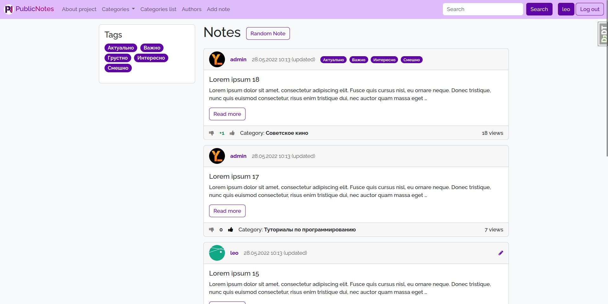
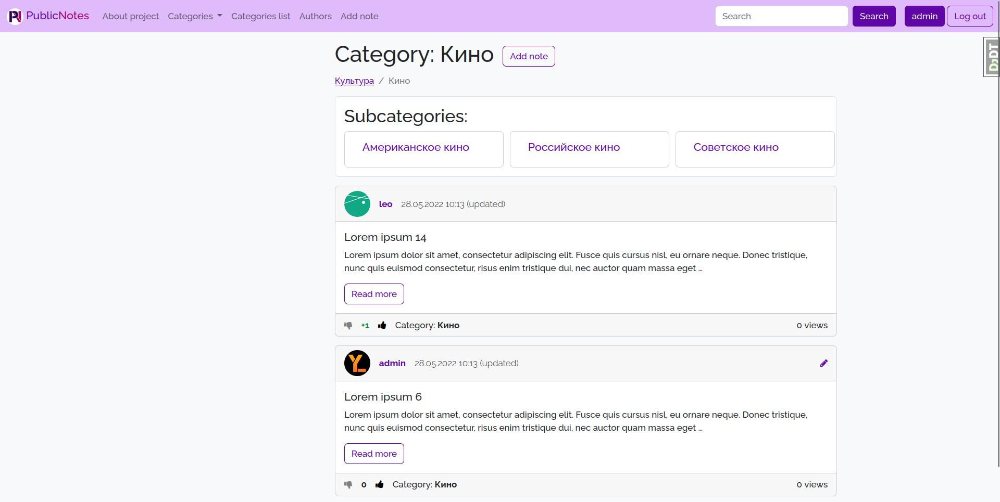

<h1 align="center"> Public Notes </h1>

<p align="center">
  <a href="https://github.com/Yu-Leo/public-notes/blob/main/LICENSE" target="_blank"> </a>
  <a href="https://github.com/Yu-Leo/public-notes/releases/latest" target="_blank"> </a>
  <a href="https://github.com/Yu-Leo/public-notes/commits/main" target="_blank"> </a>
  <a href="https://github.com/Yu-Leo/public-notes/graphs/contributors" target="_blank"> </a>
</p>

## Навигация

* [Описание проекта](#chapter-0)
* [Интерфейс](#chapter-1)
* [Как начать](#chapter-2)
* [Код](#chapter-3)
* [Лицензия](#chapter-5)

<a id="chapter-0"></a>

## :page_facing_up: Описание проекта

Сайт, на котором пользователи могут оставлять заметки.

### Функциональность:

- Заметки:
    - Отображение одним списком (главная страница)
    - Отображение по категориям. Каждая заметка может принадлежать одной категории
    - Отображение по тегам. Каждая заметка может иметь несколько тегов
    - Счётчик кол-ва просмотров
    - Поиск по названиям
    - Добавление публичных и приватных заметок
    - Редактирование
    - Удаление
- Отображение списка авторов
- Профиль:
    - Регистрация
    - Подтверждение e-mail по одноразовой ссылке
    - Отображение профиля и заметок
    - Изменение данных профиля
    - Смена пароля
    - Удаление профиля
- Категории:
    - Отображение категорий в виде списка с различными уровнями вложенности
    - Каждая категория может иметь подкатегории. Заметки могут относиться как к родительской, так и к дочерним
      категориям

<a id="chapter-1"></a>

## :camera: Интерфейс

- **Главная** - главная страница сайта, на которой отображаются все заметки.
- **О проекте** - страница с информацией о проекте
- **Категории** - распределение заметок по категориям
- **Список категорий** - отображение категорий в виде списка с различными уровнями вложенности
- **Авторы** - список авторов, оставивших свои заметки на сайте
- **Добавить заметку** - форма добавления заметки (только для авторизованных пользователей)
- **Поиск** - поиск по названиям заметок
- **\<username\>** - профиль пользователя (только для авторизованных пользователей)






<a id="chapter-2"></a>

## :hammer: Как начать

1. Скачать данный репозиторий
    * Вариант 1
        1. Установить [git](https://git-scm.com/download)
        2. Клонировать репозиторий
        ```bash
        git clone https://github.com/Yu-Leo/public-notes.git
        cd public-notes
        ```
    * Вариант 2 - [Скачать ZIP](https://github.com/Yu-Leo/public-notes/archive/refs/heads/main.zip)
2. Создать виртуальное окружение в репозитории проекта
    ```bash
    python3 -m venv venv
    ```
3. Активировать виртуальное окружение
    ```bash
    source venv/bin/activate
    ```
4. Установить зависимости проекта
    ```bash
    pip install -r requirements.txt
    ```
5. Задать [необходимые переменные окружения](#envvars).
    * Вариант 1.
      Задать вручную.
        ```bash
        export VAR_NAME=VAR_VALUE
        ```
    * Вариант 2.
      Использовать [direnv](https://direnv.net/).
        1. [Установить direnv](https://direnv.net/docs/installation.html)
        ```bash
        sudo pacman -S direnv
        ```
        2. В корне директории создать файл `.envrc`, в котором прописать необходимые переменные окружения
        ```bash
        export VAR_NAME=VAR_VALUE
        ```
        3. Разрешить запуск файла `.envrc` при входе в директорию
        ```bash
        direnv allow
        ```
6. Скомпилировать переводы фраз:
    1. Общие (в папке `publicnotes`)
    ```bash
       django-admin compilemessages
    ```
    2. Для приложения 'walls' (в папке `publicnotes/walls`)
    ```bash
       django-admin compilemessages
    ```
7. Запустить сервер
    ```bash
    cd publicnotes
    python manage.py runserver
    ```

<a id="chapter-3"></a>

## :computer: Код

### :wrench: Используемые технологии

#### BackEnd:

- СУБД: **SQLite3**
- Язык программирования: **Python (3.10.4)**
- Фреймворки и библиотеки:
    - **Django (3.1.14)**
    - **django_debug_toolbar (2.2.1)**
    - **django_mptt (0.13.4)**
- Веб-сервер: **gunicorn**

#### FrontEnd:

- Языки: **html**, **css**
- Фреймворки и библиотеки:
    - **Bootstrap 5**

### :file_folder: Папки и файлы

- **publicnotes** - исходный код проекта
    - **media** - папка с медиа-файлами
    - **locale** - папка с переводами
    - **config** - настройки проекта
    - **templates** - общие шаблоны проекта
    - **wall** - главное Django приложение проекта
        - **locale** - папка с переводами
        - **migragions** - файлы миграций
        - **services** - бизнес-логика приложения
        - **static** - файлы статики
        - **templates** - шаблоны приложения
        - **templatetags** - кастомные теги
        - **tests** - тесты
        - **admin.py** - настройки админки
        - **apps.py**
        - **exceptions.py** - кастомные исключения
        - **forms.py** - формы и их настройки
        - **generate_fake_data.py** - скрипт для генерации случайных заметок
        - **models.py** - модели приложения
        - **urls.py** - настройки URL приложения
        - **utils.py** - утилиты, используемые в бизнес-логике
        - **views.py** - представления моделей
- **docs** - документация

### :wrench: Настройки

<a id="envvars"></a>

#### Необходимые переменные окружения:

- `DJANGO_SECRET_KEY` - SECRET_KEY для конфига Django
- Настройки отправки e-mail:
    - `EMAIL_HOST`
    - `EMAIL_PORT`
    - `EMAIL_HOST_USER`
    - `EMAIL_HOST_PASSWORD`

### :coffee: Тесты

Запуск всех тестов (выполнять в папке **publicnotes**):

```bash
./manage.py test wall.tests
```

С использованием `coverage`:

```bash
coverage run ./manage.py test wall.tests
```

С генерацией страницы отчета:

```bash
coverage run ./manage.py test wall.tests && coverage html
```

<a id="chapter-5"></a>

## :open_hands: Лицензия

Используете мой код - ставьте звёздочку ⭐️ на репозиторий

Автор: [Yu-Leo](https://github.com/Yu-Leo)

GNU General Public License v3.0

Полный текст в [LICENSE](LICENSE)
