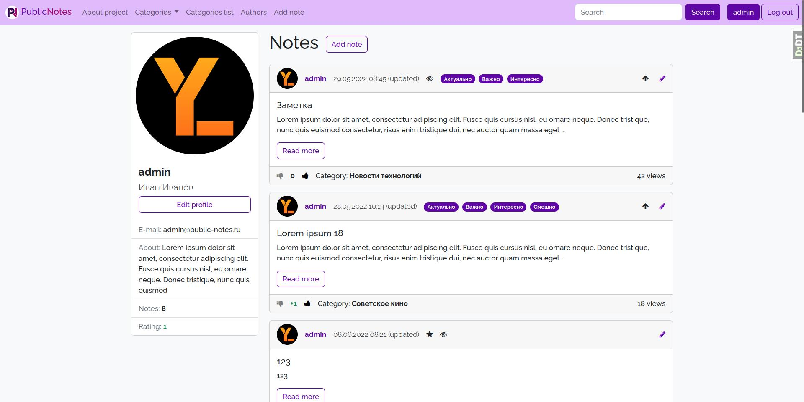

<h1 align="center"> Public Notes </h1>

<p align="center">
  <a href="https://github.com/Yu-Leo/public-notes/blob/main/LICENSE" target="_blank"> </a>
  <a href="https://github.com/Yu-Leo/public-notes/releases/latest" target="_blank"> </a>
  <a href="https://github.com/Yu-Leo/public-notes/commits/main" target="_blank"> </a>
  <a href="https://github.com/Yu-Leo/public-notes/graphs/contributors" target="_blank"> </a>
</p>

## Navigation

* [Project description](#chapter-0)
* [Interface](#chapter-1)
* [Getting started](#chapter-2)
* [Source code](#chapter-3)
* [License](#chapter-5)

<a id="chapter-0"></a>

## :page_facing_up: Project description

The website where users can write public notes.

See full description in [technical documentation](./docs/README.md).

<a id="chapter-1"></a>

## :camera: Interface

- **Main** - the main page of the site where all notes are displayed
- **About** - project information page
- **Categories** - distribution of notes by category
- **Categories list** - displaying categories as a list with different levels of
  nesting
- **Authors** - list of authors who wrote notes on the site
- **Add note** - form for adding notes (only for authorized users)
- **Search** - search by note titles
- **\<username\>** - user profile (only for authorized users)





<a id="chapter-2"></a>

## :hammer: Getting started

1. Download this repository
    - Option 1
        1. Install [git](https://git-scm.com/download)
        2. Clone this repository
         ```bash
         git clone https://github.com/Yu-Leo/public-notes.git
         cd public-notes
         ```
    - Option 2 - [Download ZIP](https://github.com/Yu-Leo/public-notes/archive/refs/heads/main.zip)
2. Set the values of the [required environment variables](#envvars)
    - Create `.env` file with values for **production** mode
    - Create `.env.dev` file with values for **development** mode

Now you can:

- Run in **production** mode using docker-compose
- Run in **development** mode using docker-compose
- Setting up for development and run on a local machine

### Run in **production** mode using docker-compose:

```bash
docker-compose up --build
```

### Run in **development** mode using docker-compose:

```bash
docker-compose -f docker-compose.yaml -f docker-compose.dev.yaml up --build
```

### Setting up for development and run on a local machine:

1. Create a virtual environment in the project repository
    ```bash
    python3 -m venv venv
    ```
2. Activate the virtual environment
    ```bash
    source venv/bin/activate
    ```
3. Install project dependencies
    ```bash
    pip install -r requirements.txt
    ```
4. Compile phrase translations
    1. Install `gettext`:
    ```bash
    sudo apt-get install gettext
    ```
    2. Run in `publicnotes` folder:
    ```bash
    django-admin compilemessages
     ```
5. Run the server
    ```bash
    cd publicnotes
    python manage.py runserver
    ```

<a id="chapter-3"></a>

## :computer: Source code

### :books: [Technical documentation](./docs/README.md)

### :wrench: Technologies

#### BackEnd:

- DBMS: **SQLite3**
- Programming language: **Python (3.10.4)**
- Frameworks and libraries:
    - **Django (3.1.14)**
    - **django_debug_toolbar (2.2.1)**
    - **django_mptt (0.13.4)**
- Web server: **gunicorn**

#### FrontEnd:

- Languages: **html**, **css**
- Frameworks and libraries:
    - **Bootstrap 5**

#### Tools:

- Docker and Docker compose

### :wrench: Settings

<a id="envvars"></a>

#### Required environment variables:

- `DJANGO_DEBUG` - Run in DEBUG mode or not (set 1 or 0). Default 0.
- `DJANGO_SECRET_KEY` - SECRET_KEY for the Django config
- Settings for sending e-mail:
    - `EMAIL_HOST`
    - `EMAIL_PORT`
    - `EMAIL_HOST_USER`
    - `EMAIL_HOST_PASSWORD`

### :coffee: Tests

Run all tests (run in the **publicnotes** folder):

```bash
./manage.py test wall.tests
```

Using `coverage`:

```bash
coverage run ./manage.py test wall.tests
```

With report page generation:

```bash
coverage run ./manage.py test wall.tests && coverage html
```

<a id="chapter-5"></a>

## :open_hands: License

If you use my code, put a star ⭐️ on the repository

Author: [Yu-Leo](https://github.com/Yu-Leo)

GNU General Public License v3.0

Full text in [LICENSE](LICENSE)
