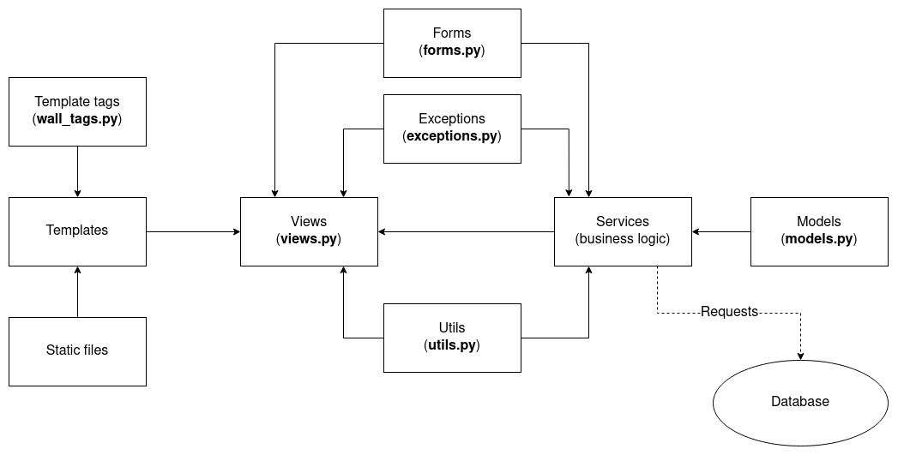
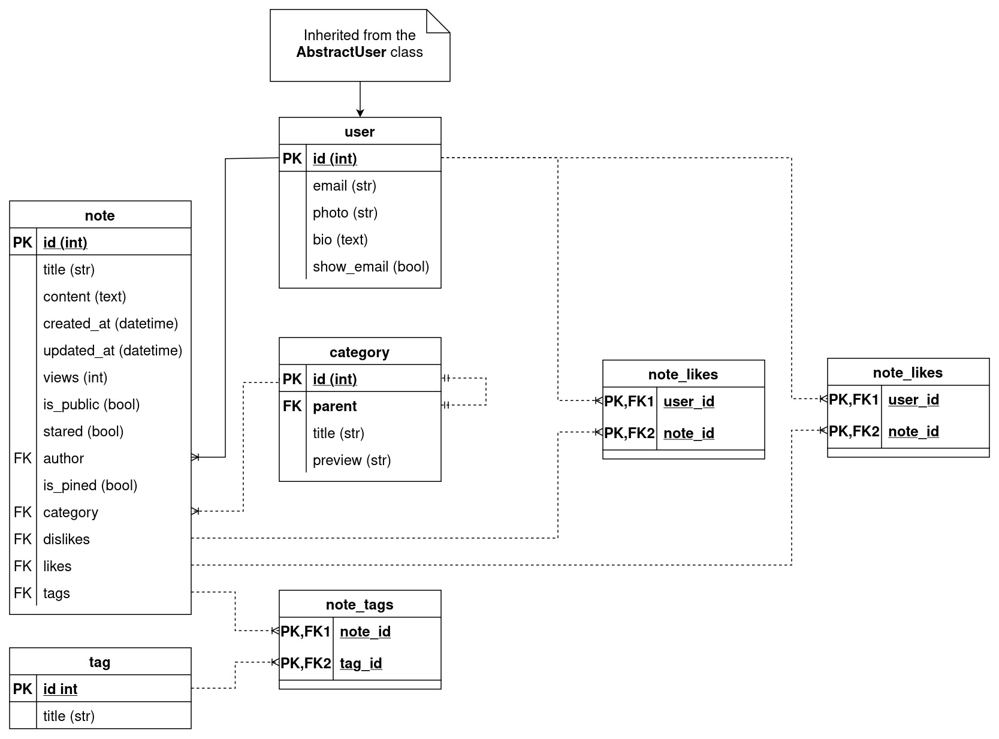

# Public notes documentation

## :page_facing_up: Description

The website where users can write public notes.

### Functionality:

- Notes:
    - Displaying a single list (main page)
    - Displaying by category. Each note can belong to one category
    - Displaying by tags. Each note can have multiple tags
    - Number of views counter
    - Search by titles
    - Adding public and private notes
    - Ability to pin notes (pinned notes will be displayed at the top of the
      list on the profile page)
    - Rating system: each like increases the rating by 1, each dislike decreases
    - Editing
    - Deleting
- Displaying the list of authors
- Profile:
    - Registration
    - Confirmation of e-mail by one-time link
    - Displaying profile and notes
    - Rating system: user's rating is the sum of ratings of his public notes
    - Changing profile data
    - Changing the password
    - Deleting a profile
- Categories:
    - Displaying categories as a list with different levels of nesting
    - Each category can have subcategories. Notes can belong to both parent and
      child categories
- Support for Russian and English languages

## :orange_book: Architecture

Original: [modules_diagram.drawio](./modules_diagram.drawio)

## :blue_book: Database schema

Original: [database_schema.drawio](./database_schema.drawio)

## :file_folder: Folders and files

- **publicnotes** - project source code
    - **media** - folder with media files
    - **locale** - folder with translations
    - **config** - project settings
    - **templates** - common project templates
    - **wall** - the main Django application of the project
        - **locale** - folder with translations
        - **migrations** - migration files
        - **services** - business logic of the application
        - **static** - static files
        - **templates** - application templates
        - **templatetags** - custom tags
        - **tests** - tests
        - **admin.py** - admin panel settings
        - **apps.py**
        - **exceptions.py** - custom exceptions
        - **forms.py** - forms and their settings
        - **generate_fake_data.py** - script for generating random notes (for
          manual testing)
      - **models.py** - application models
      - **urls.py** - application URL settings
      - **utils.py** - utilities used in business logic
      - **views.py** - model representations
- **docs** - documentation
- **docker-compose.dev.yaml** - docker-compose config for **development**
- **docker-compose.yaml** - docker-compose config for **production**
- **Dockerfile.dev** - docker config for **development**
- **Dockerfile** - docker config for **production**

**Using caching.** The cache is saved to `/var/tmp/django_cache/publicnotes/`. Updates every 5 minutes
